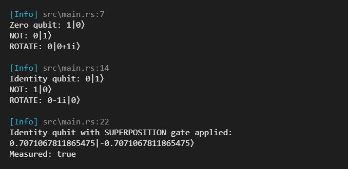

# rquant
  

A quantum computing library written entirely in rust.

It allows for qubit measurement and basic quantum logic in complex vector space. Gates can be applied to qubits in complex vector space, then those qubits can be measured to observe the outcome.

## Getting Started
1. Download the repo
1. Open a terminal and navigate to the repo root
1. Run `cargo run` to see the output of the (very simple) [`main`](src/main.rs) function
1. Run `cargo test` to run all the tests
1. Run `cargo doc --no-deps` to generate the docs

## Examples
You can do basic operations on qubits using the following example:
```rust
use rquant::{
    log_info,
    quantum::types::{qubit::Qubit,quantum_gate::QuantumGate}
};

fn main() {
    log_info!(
        "Zero qubit: {}\nNOT: {}\nROTATE: {}",
        Qubit::zero(),
        !Qubit::zero(),
        Qubit::zero().apply_gate(&QuantumGate::ROTATE)
    );

    log_info!(
        "Identity qubit: {}\nNOT: {}\nROTATE: {}",
        Qubit::one(),
        !Qubit::one(),
        Qubit::one().apply_gate(&QuantumGate::ROTATE)
    );

    let superpositioned_identity_qubit = Qubit::one().apply_gate(&QuantumGate::SUPERPOSITION);
    log_info!(
        "Identity qubit with SUPERPOSITION gate applied:\n{}\nMeasured: {}\n",
        superpositioned_identity_qubit,
        superpositioned_identity_qubit.measure()
    );
}
```

Running the previous example will produce the following output:



## Dependencies
|Crate|Purpose|
|-|-|
|[rand v0.9.1](https://docs.rs/rand/0.9.1/rand/index.html)|Used to measure qubit position|
|[num-complex v0.4](https://docs.rs/num-complex/0.4.6/num_complex/index.html)|Used as the basis of quantum positions for qubits|